## How to be a block producer

On the home page of [Block Producers], click [My Producer], as shown below.

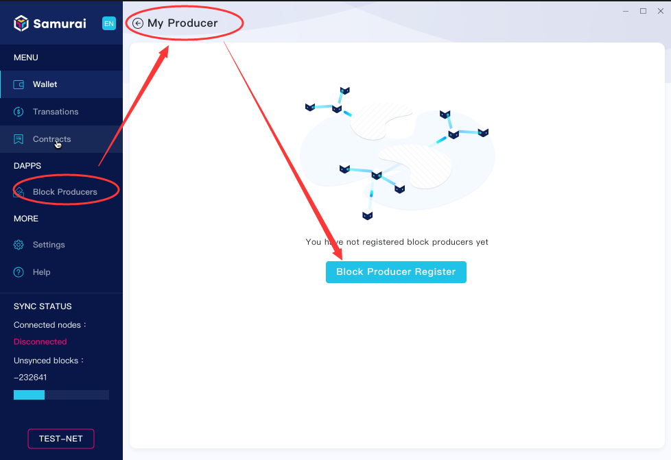

1.Click [Block Producer Register], the client navigates to [Block Producer Register], set the [Account Name], input [Node Info], and set [Profit Plan], input [Institution Info], click [Next], as shown below:

**Note : **

*want to know how to get the the Node address(IP, port) and node ID(Public Key), please click[here](en-us\basics\[English]-Private-Networks)* 

2.Stake:Select [Payment Wallet], input [Stake Amount], set the [Fee], click [Submit], as shown below:

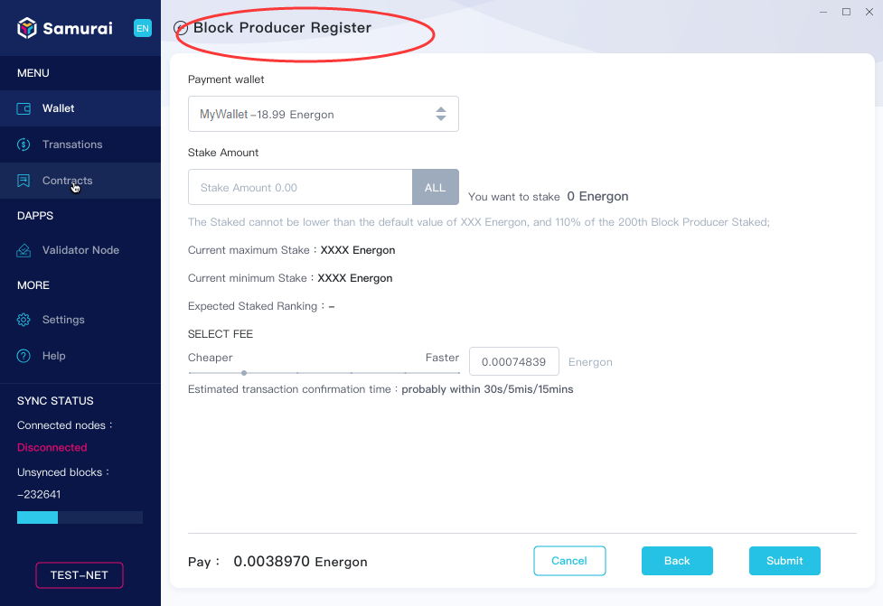

**Note : Stake Amount**

*Assume the current blcok producers are sorted by stake amounts, if the number of queuing block producers exceeds 200, and X is the 200th block producer’s stake amount. The newly inputted stake amount should be greater than 110% of X, otherwise it will not get accepted. In case the number of queuing block producers is less than 200, then the stake amount must be greater than defined default amounts .* 

3.The confirmation dialogue box pops up, please input the Payment wallet’s [Wallet Password], click [Submit], as show below:

4.The registering may take a few minutes to complete, as shown below:

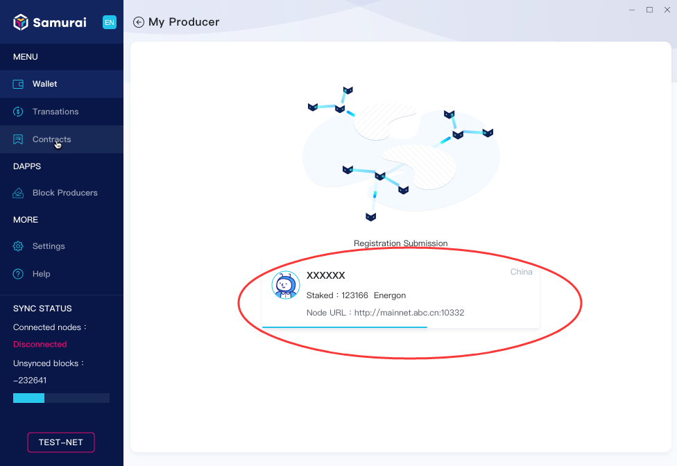

5.Once completed, the client navigates to [My Producer] page, as shown below:

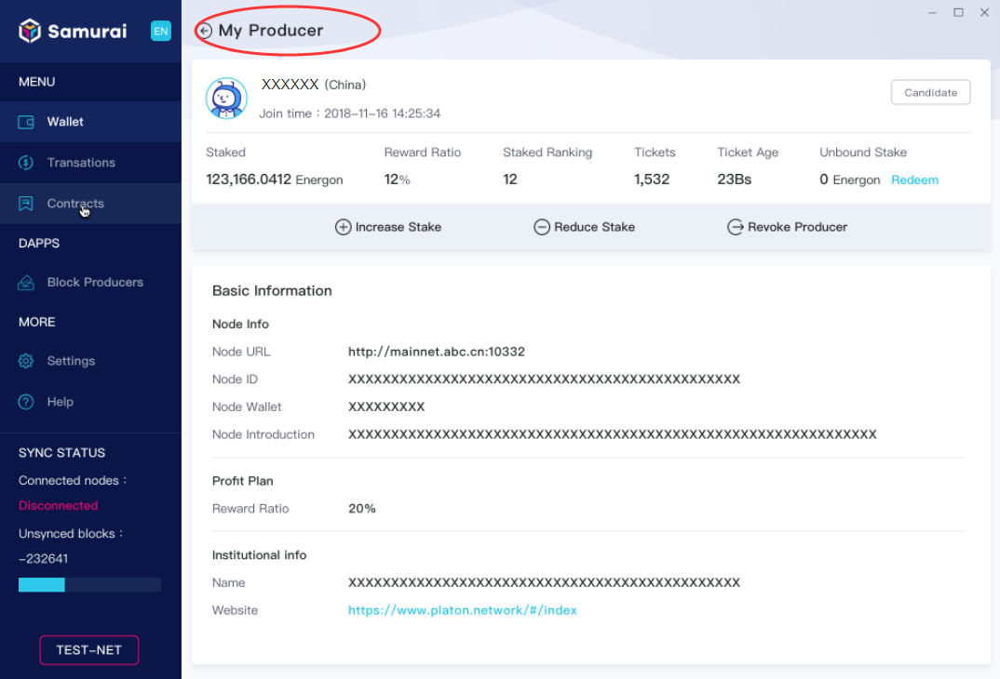

## How to avoid your block producter being eliminated

Only if nodes satisfy both conditions: staked assets ranking top 100 and the number of votes reaching 512 ( K value on testnet), will PlatON list them as candidate nodes. So there may not be 100 candidates sometime.

If the node does not get at least 512 votes, and their staked assets rank top another 100 except candidate nodes, PlatON lists them as standby nodes.

Therefore, the more assets staked, the higher the ranking, the smaller the risk of being eliminated.

1.On the [My Producer] page, click [Increase Stake], as shown below:

2.On [Increase Stake] page, select the [Payment Wallet], input [Stake Amount], and set the [Fee], click [Submit], as shown below:

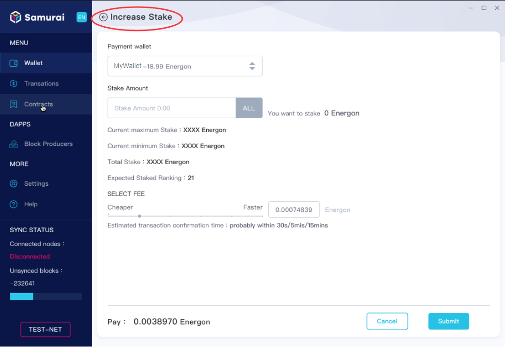

**Note : Stake Amount**

*Increase stake,the stake amount cannot be less than 10% of the this node Staked*

3.The confirmation dialogue box pops up, input the payment wallet’s [Wallet password], click [Submit], as shown below:

4.Status of increasing staking amount after submit, as shown below:

## How to improve the probability of becoming a validator

According to Platon's consensus mechanism, the node becomes the consensus candidate node by staking assets, and the node with staked assets ranking top 100 and the number of votes satisfying 512 votes will enter the candidate pool and have the opportunity to become the validator.

PlatON randomly select 25 nodes from the candidate pools as validator per round (250 blocks), and ccalculate the votes’ age according to the amount and duration of votes voted to the node (the vote age increases as the block height increases): the higher cumulative votes age (the cumulative  votes age of the node is the sum of the each vote age ), The higher the probability tobe a validator.

Therefore, by increasing the number of votes and accumulating votes, the probability of becoming a  validator can be increased.

## How to vote for a block producer
To participate in the block producers voting,  you will have the opportunity to receive block rewards. For more information please click [here](en-us\technologies\[English]-Probability-POS)

1.On the home page of [Block Producers], select the vote object, click the icon of [vote], as shown below:

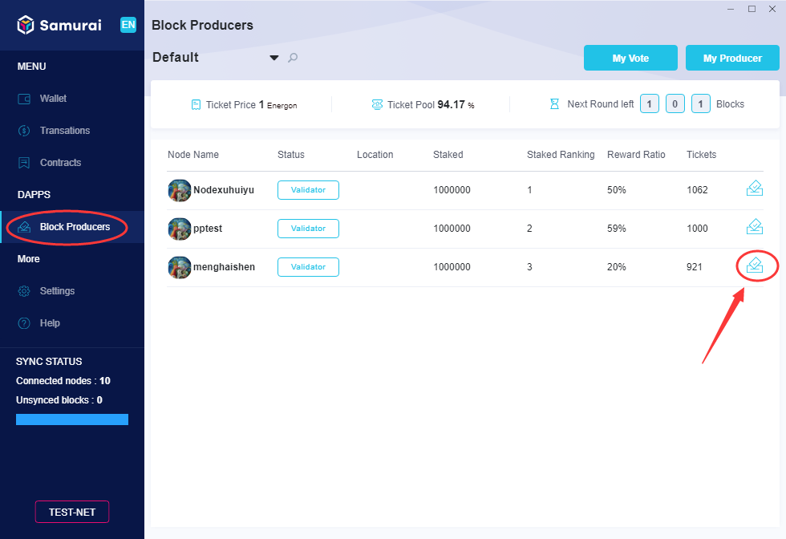

2.The client switch to [Vote] page,  Select [Voting wallet], and set the amount of [Tickets], click [Submit], as shown below:

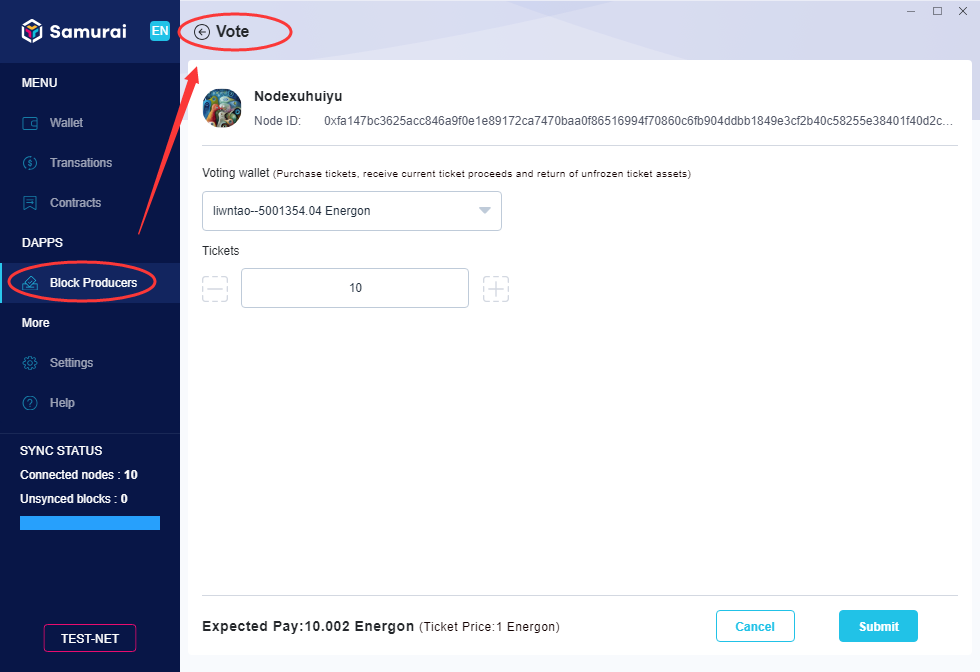

3.In the dialogue box of confirmation that pops up, input  [Wallet Password], click [Submit], as shown below:

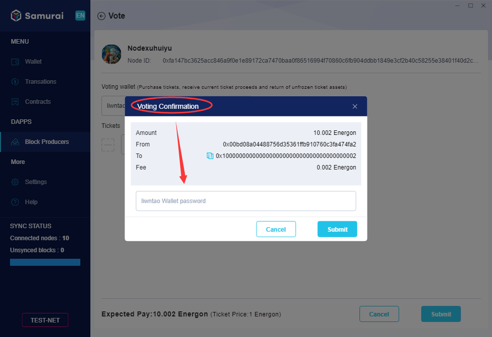

4.Review my vote, on the home page of [Block Producers], click [My Vote], to review the voting records, as shown below:

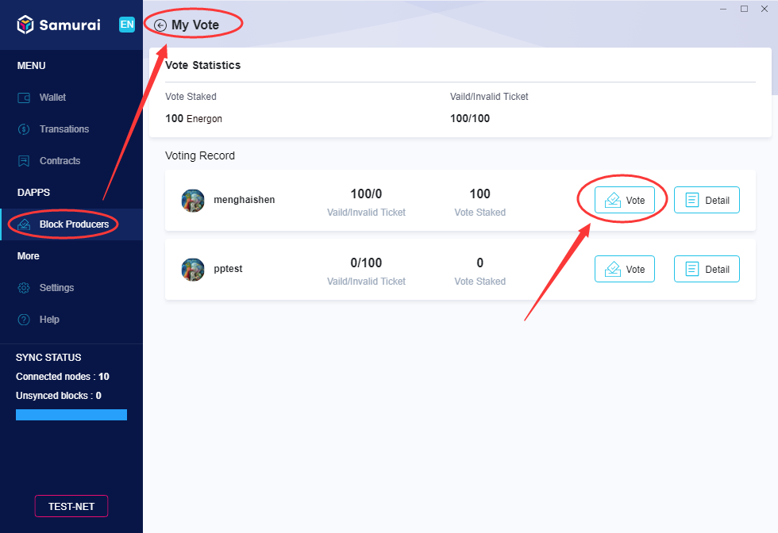

Of course, you can continue to increase voting for the nodes that have already voted, click [Add Vote], and the page will switch to the [Vote] page. The operation steps are the same as [Vote], and will not be described again.

**Note : Voting rules**

- *Maximum 51,200 tickets for ticket pool*
- *Stake the corresponding Energon based on the fare and the number of votes purchased.*
- *Ticket withdrawing is forbidden during the validity period.*
- *One ticket voted for one Node.*
- *Ticket life cycle: 1,536,000 blocks.*
- *The Tickets would expire if have not been selected during the voting period, and be released from the ticket pool and unlock the locked assets to the voting wallet.*
- *If the block producers that have been voted for are eliminated, the node's votes will be released and unlock the locked assets to the voting wallet.*
- *The selected lucky Tickets, will unlock the assets locked by the ticket to the voting wallet after being released from voting pool.*
- *The selected lucky ticket, will receive the block reward dividend according to the dividend ratio set by the consensus node.*

## Why are block producers eliminated

As described before, PlatON ranks the top 100 nodes as candidate nodes, and ranks the top 101-200 nodes as standby nodes, and the nodes beyond 200 will be removed from block producers list, sorted by voting tickets and staking amount. So, when a new node with enough staking and voting tickets appears within top 200 ranking, the current 200th block producers will be replaced, and the voting tickets associated will be released as well.

The more staking amount, the higher the ranking, and results higher probability to become consensus node. So to increase the staking amounts of stake, can improve the probability effectively.

## How to re-register for block producer if eliminated

One the page of [My Producer], click [Rejoin], the client will return to the process of registering for block producer, you can click [How to be a block producer](#How-to-be-a-block-producer) to view the operation process.

## How to revoke the block producer
1.On the page of [My Producer], click [Revoke Producer], a warning dialogue box pops up, click [Comfirm], as shown below:

2.The dialogue box of confirmation pops up, input the node’s [Wallet password], click [Submit], as shown below:

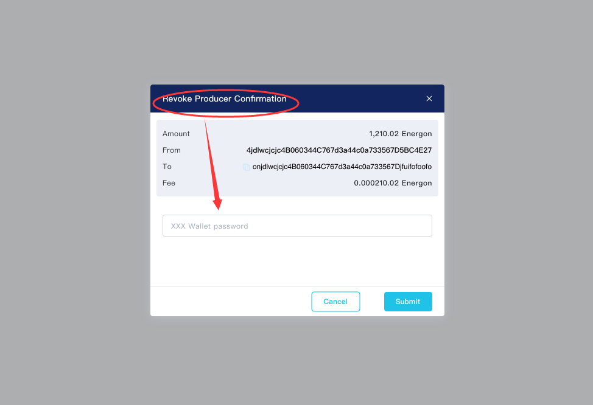

3.After submitting, on the page of [My Producer], the processing status of revoking producer will be displayed, as shown below:

## How to redeem the stakes

Stake being reduced, node being eliminated, or revoking producer, for any of these reasons, you can apply for redeeming the stake, the steps are as below.

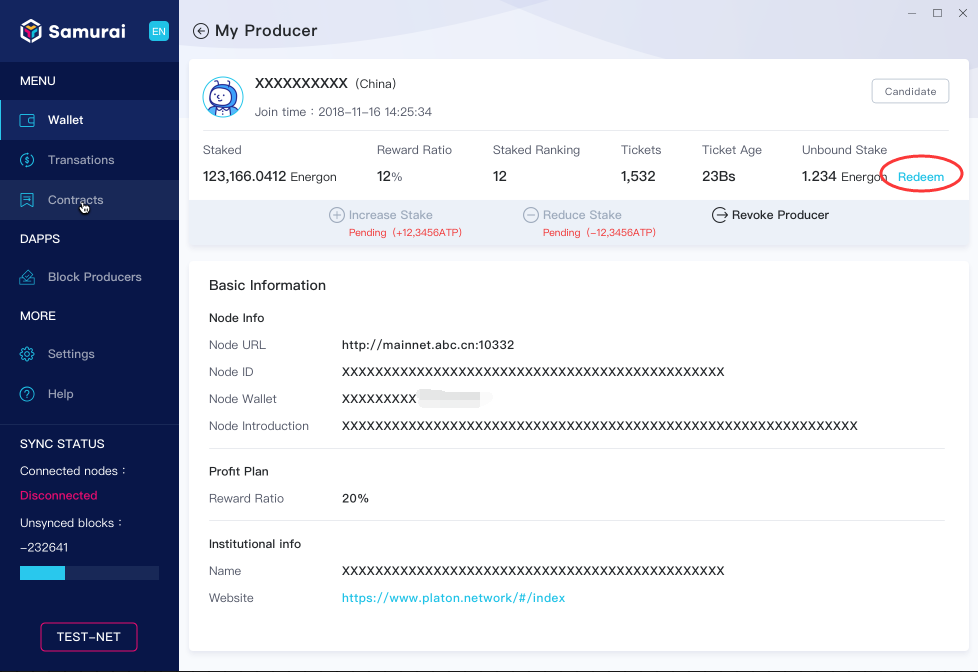

1.On the page of [My Producer], click [Redeem], and a tip pops up, click [confirm], as shown below:

2.The dialogue box of confirmation pops up, and input the node’s [Wallet password], click [Submit], as shown below:

3.After submitting, on the page of [My Producer] will display the status of redemption. As shown below:

**Note : Stake redemption**

*The released stakes need to be redeemed proactively, for they won’t return to the payment wallet automatically.*

